# Particle Filter Experiments

This project explores the influence of different **weight computation methods**, **motion models**, and **observation error models** on particle filter behavior.  
By running the filter in multiple environments (from very easy to very challenging), we observe how these choices affect convergence, robustness, and accuracy.

---

## Requirement

### Create Virtual Env (python3)

- Create a virtual env at the repository root

```bash
python -m venv venv
```

- Swtich to virtual env

```bash
source ./venv/bin/activate      
```

- To go back to host env simply execute command below:

```bash
deactivate
```

### Install requirments

- When venv is created and activate, install python dependencies:

```bash
pip install -r requirements.txt
```

## How to start

- Start the simulation

```bash
chmod +x ./scripts/Plane_Simulation.py
cd scripts
./Plane_Simulation.py
```

---

# Influence of Test Environments and Weight Models

In this section, we compare **five different environments**—some very easy, others quite difficult—using **three different weight computation methods**. The goal is to observe how the choice of weight model affects particle convergence.

The three weight models tested are:  

- **Exponential**  
- **Gaussian**  
- **Inverse Distance**

---

## Exponential

The exponential model computes weights as:

```python
weight = math.exp(-lam * error)
```

Which corresponds to:

\[
w = \exp(-\lambda \cdot |error|)
\]

This means that weights decrease **exponentially** as the error increases. With \(\lambda = 0.5\), the decrease is moderate, so particles further from the observation are penalized, but not too harshly.

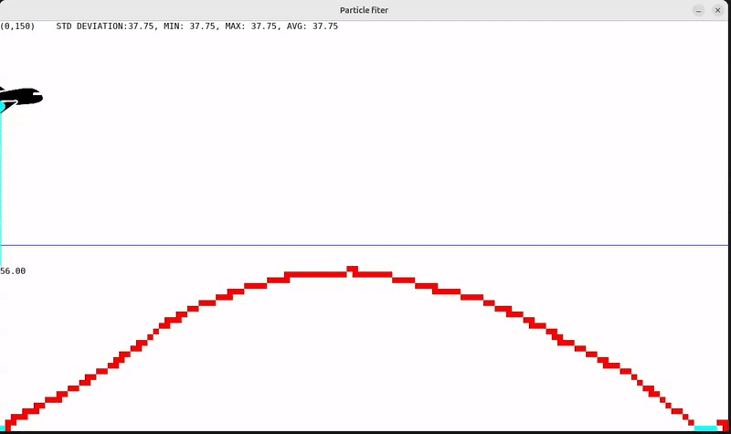  
*Easy environment: particles quickly converge to the plane because the terrain is distinctive.*

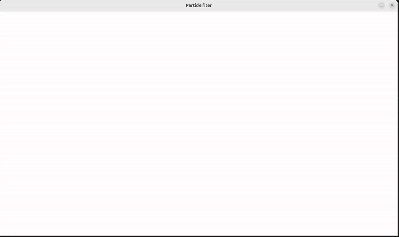  
*Moderately difficult environment: still distinctive terrain (mountains), particles converge reliably.*

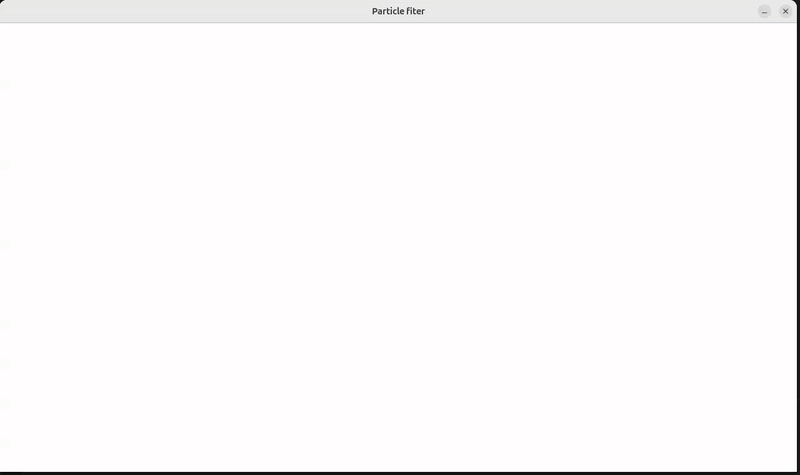  
*Flat terrain: particles struggle to precisely locate the plane during its motion.*

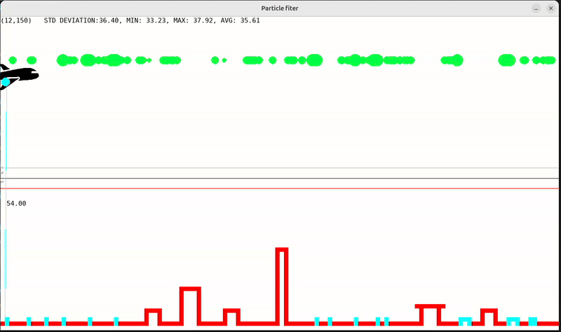  
*Terrain with many repeated heights: particles need distinctive landmarks (mountains) to converge.*

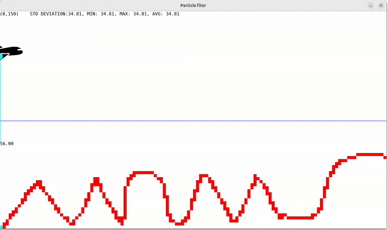  
*Most difficult environment: many similar mountain shapes cause confusion. Particles regroup in multiple candidate regions before converging.*

In summary: exponential weighting works well in easy environments, but struggles when the terrain has many repeating patterns.

---

## Gaussian

The Gaussian model computes weights as:

```python
weight = math.exp(- (error ** 2) / (2 * self.DISTANCE_ERROR ** 2)) / (math.sqrt(2 * math.pi) * self.DISTANCE_ERROR)
```

Which corresponds to:

\[
w = \frac{1}{\sqrt{2 \pi} \, \sigma} \exp\!\left(-\frac{(error)^2}{2\sigma^2}\right), \quad \sigma = \text{DISTANCE\_ERROR}
\]

Here, \(\sigma\) controls how tolerant the model is to observation error. Small \(\sigma\) means strict penalization; large \(\sigma\) means more tolerance.

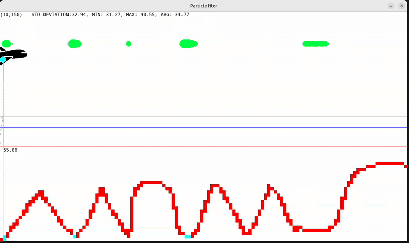  

---

## Inverse Distance

The inverse distance model computes weights as:

```python
weight = 1.0 / (1.0 + error)
```

Which corresponds to:

\[
w = \frac{1}{1 + |error|}
\]

This is a simpler function: weights decrease steadily as error increases, without sharp drops.

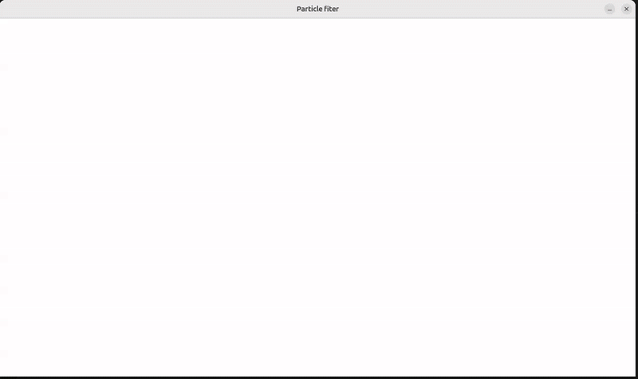  

---

# Influence of Motion Models

So far, all animations used **roulette wheel selection**: particles are resampled with probability proportional to their weight. This ensures “good” particles are preserved, while leaving room for exploration.

Other motion models can also be used. Let’s compare two alternatives:

---

### Keep Top Particles + Add Random Explorers

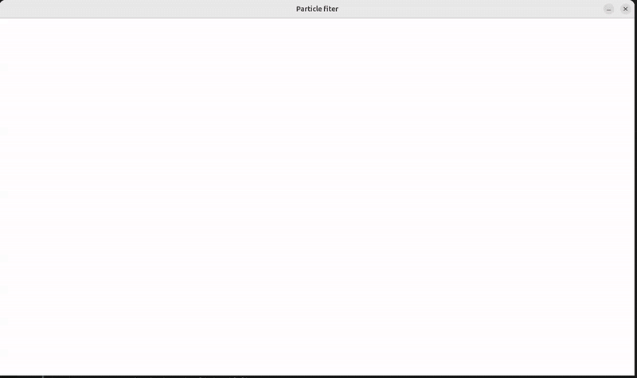  

In this model, the **top 10% of particles (highest weight)** are always kept. The remaining 90% are resampled with roulette wheel selection.  

- **Advantage**: faster convergence, since strong candidates are guaranteed to survive.  
- **Disadvantage**: risk of “tunnel vision”—particles sometimes lock onto wrong regions more often than with pure roulette resampling.  

---

### Direct Gaussian Motion Model

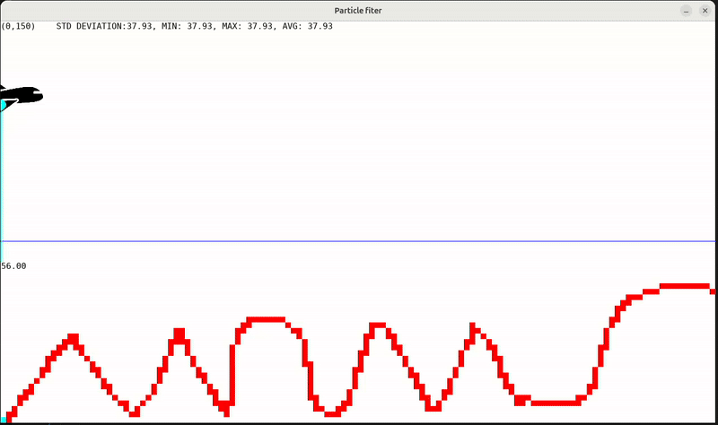  

Here, instead of moving particles with a uniform random offset, we use Gaussian-distributed motion:

```python
dx = int(random.gauss(0, 2))  # mean 0, std 2
```

This assumes the plane’s motion is uncertain and normally distributed.  

- **Advantage**: more realistic for noisy real-world systems.  
- **Disadvantage**: in our case, the Gaussian spread causes particles to explore too widely, often drifting away from the correct trajectory.  

Thus, this model is **not well-suited to our specific setup**.

---

# Influence of Observation Error Model

Finally, we tested the effect of increasing the observation error parameter \(\sigma = \text{DISTANCE\_ERROR}\) in the Gaussian weight model. The motion model used here is “Keep Top Particles.”

We gradually increased \(\sigma\) from 2 → 20 → 40:

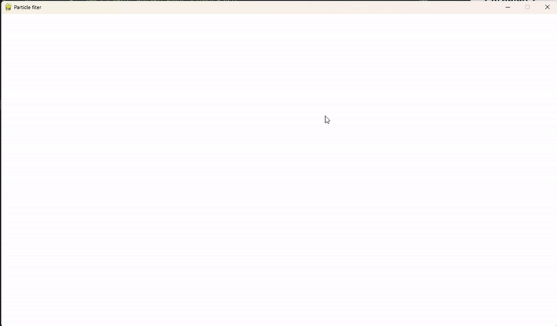  
*Small error: strict weighting, fast convergence, but risk of rejecting good particles if the sensor is noisy.*  

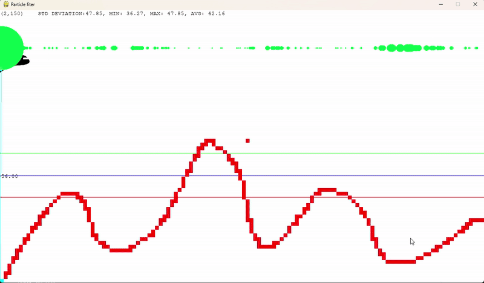  
*Moderate error: smoother weighting, particles are more tolerant, convergence remains stable.*  

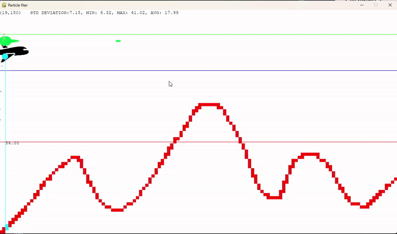  
*Large error: very tolerant, almost all particles survive, making convergence slower and less precise.*  

---

# Plane 2D Simulator

In the final part of these experiments, we allow the plane to move along the y-axis, so particles can now spawn anywhere in the 2D space, not just along a single line.

Unfortunately, we observe a significant change in particle behavior. Although particles are distributed across the entire environment, many fail to converge effectively on the plane. Some particles that initially spawn near the plane briefly move toward it, but then quickly disappear or drift away.

A likely reason for this issue is the `motion_prediction()` function: too many particles may be spawned in regions with already high weight, causing poor particle diversity and rapid particle depletion around the plane.

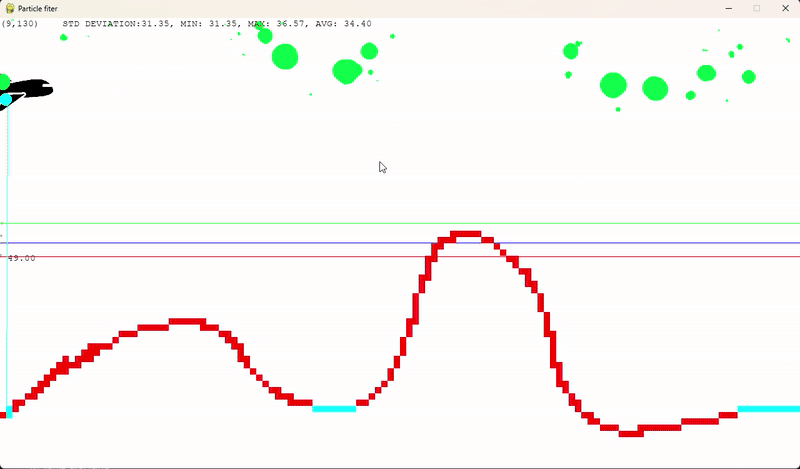
*Particle filter struggling when the plane can move along the y-axis*

